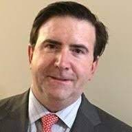

We are happy to annouce some of the speakers that will be at BSides Roanoke with more set to be added soon!

## Rob Perry

Robert Perry is the Chief Information Security Officer (CISO) for Carilion Clinic, one of the largest hospitals and healthcare providers based in southwest Virginia, serving nearly one million in the Virginia community and surrounding areas.

As an expert in the technology industry, Mr. Perry’s charismatic speaking style and passion for technology and cybersecurity have made him a sought after speaker at conferences. Speaking topic range in areas including: cybersecurity systems, and tools, attack and counter attack cybersecurity response systems, authentication and access control.

## Tom Weeks

Tweeks (or Thomas Weeks) is the Director of Future Technology at Virginia Tech, Division of IT, and also sits as a Consulting Engineer at the Virginia Cyber Range where he creates cloud VM images for the Range, writes/edits Range labs, and works with Range authors to get their lab  content working in the Range.  Tweeks is a also a homeschooling technologist who's been teaching STEM / technology classes for 20+yrs, sits on the SW VA region's RBTC STEM and CyberSecurity committees and is very active in the NRV STEM education community. In his spare time he  likes playing with high power rockets as President of nrvr.org, electronics and really loves teaching kids how to peek behind the curtain of modern technology (LetsCodeBlacksburg.org).

## Logan Diomedi

Logan is a Roanoke native and has lived here most of his life.  Logan has worked in several IT roles with various local companies in the Roanoke valley and now works remotely for an out of state company located in Kansas City as a Senior Offensive Security Consultant.   Logan is an experienced pen tester and has performed security assessments for various clients of all sizes and business types.   Logan is a proud member of RISE and loves working in the infosec community to share knowledge and mentor others.
